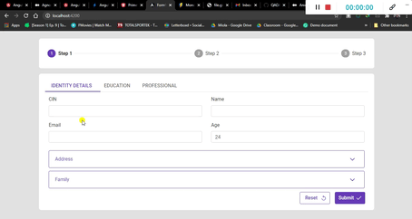

# FormValidator

this generic Angular component can be used to manage the validation in any Angular form

<!-- toc -->

- [Features](#features)
- [Demo](#demo)
- [Development](#development)
- [Usage](#usage)
<!-- tocstop -->

# Features

<!-- features -->

- It can be used with any Angular form
- When the form is submitted it show the invalid fields in the error-list component
- When the user clicks on an error message in the error-list it scrolls to the invalid field to show it to the end-user and let him fix it. this behavior work despite where the invalid field is located in the DOM (closed tab, closed section, nested scrollbars,...)
- if the user fixes an invalid field; its related validation error message disappear from the error-list.
- When all the invalid fields are fixed it's allow the user to submit the form
- Search for error in the error-list

<!-- featuresstop -->

# Demo

<!-- demo  -->



<!-- demostop -->

# Development

<!-- development -->

```sh-session
$ git clone https://github.com/QADA99/form-validator.git
$ cd mygit && npm install
$ ng serve
```

Navigate to `http://localhost:4200/`. The app will automatically reload if you change any of the source files.

<!-- developmentstop -->

# Usage

<!-- usage -->

```html
<form [formGroup]="form" (ngSubmit)="validator.validate()">...</form>
<form-validator #validator [form]="form" (submit)="submit()"></form-validator>
```

The form-validator works as a bridge between the form and the submit() method. When all the invalid fields are fixed it will call the submit() method(where you can send your HTTP request without checking the validation of the form).

<!-- usagestop -->
